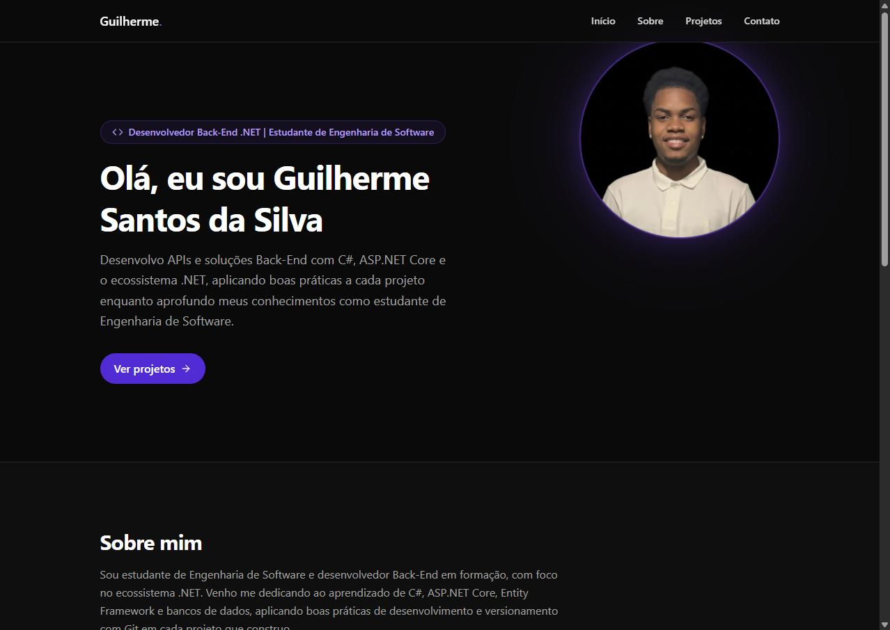

<div align="center">

# 💻 Portfólio — Guilherme Santos da Silva

Portfólio pessoal desenvolvido para apresentar minha trajetória, projetos e evolução como desenvolvedor **Back-End .NET**.


[](https://portfolio-guilherme-three-beryl.vercel.app)

</div>

---

## 📸 Preview



## 🚀 Sobre o projeto

Este é o meu portfólio pessoal, desenvolvido para apresentar minha trajetória, projetos e evolução como desenvolvedor Back-End com foco no ecossistema .NET. Sou estudante de Engenharia de Software, atualmente em busca da minha primeira oportunidade de estágio em desenvolvimento Back-End com C# e .NET.

O projeto foi construído como uma single-page application, priorizando performance, organização de código e boas práticas — os mesmos princípios que aplico no desenvolvimento back-end.

## ✨ Funcionalidades

- Layout single-page com navegação por âncoras (Início, Sobre, Projetos, Contato)
- Header fixo (sticky) com efeito de blur e menu responsivo para dispositivos móveis
- Animações de entrada e transições suaves com Framer Motion
- Seção de projetos com cards exibindo a stack tecnológica e links para repositório e demo
- Seção de contato com links diretos para GitHub, LinkedIn e e-mail
- Design responsivo construído com Tailwind CSS
- Metadados de SEO e Open Graph configurados para compartilhamento em redes sociais

## 🛠️ Tecnologias utilizadas

- **React 19**
- **TypeScript**
- **Vite 8**
- **Tailwind CSS v4** (configuração CSS-first via `@theme`)
- **Framer Motion**
- **React Icons**
- **Oxlint** (linter)
- **Deploy:** Vercel

## 📁 Estrutura do projeto

```
src/
├── components/   # Componentes reutilizáveis (Header, Footer, ProjectCard, ...)
├── data/         # Conteúdo estático tipado (projetos, skills, navegação, links sociais)
├── layouts/      # Layout principal da aplicação
├── pages/        # Páginas (Home)
├── styles/       # Tema do Tailwind CSS (configuração CSS-first)
└── main.tsx      # Ponto de entrada da aplicação
```

## ⚙️ Como executar localmente

```bash
git clone https://github.com/guilhermedev66/portfolio-guilherme.git
cd portfolio-guilherme
npm install
npm run dev
```

O projeto ficará disponível em `http://localhost:5173`.

Outros comandos úteis:

```bash
npm run build     # build de produção (type-check + Vite build)
npm run lint      # verificação de lint com Oxlint
npm run preview   # preview local do build de produção
```

## ☁️ Deploy

O projeto está hospedado na **Vercel**, com deploy automático a cada push na branch `main`. A Vercel detecta o framework (Vite), executa `npm run build` e publica o conteúdo da pasta `dist/`.

🔗 **Versão publicada:** [portfolio-guilherme-three-beryl.vercel.app](https://portfolio-guilherme-three-beryl.vercel.app)

## 📫 Contato

- LinkedIn: [linkedin.com/in/guilherme-devvv](https://www.linkedin.com/in/guilherme-devvv/)
- GitHub: [github.com/guilhermedev66](https://github.com/guilhermedev66)
- Portfólio: [portfolio-guilherme-three-beryl.vercel.app](https://portfolio-guilherme-three-beryl.vercel.app)

## 📄 Licença

Este projeto está licenciado sob a licença MIT.
Consulte o arquivo [LICENSE](./LICENSE) para mais informações.

---

<div align="center">

Desenvolvido por **Guilherme Santos da Silva**.

</div>
